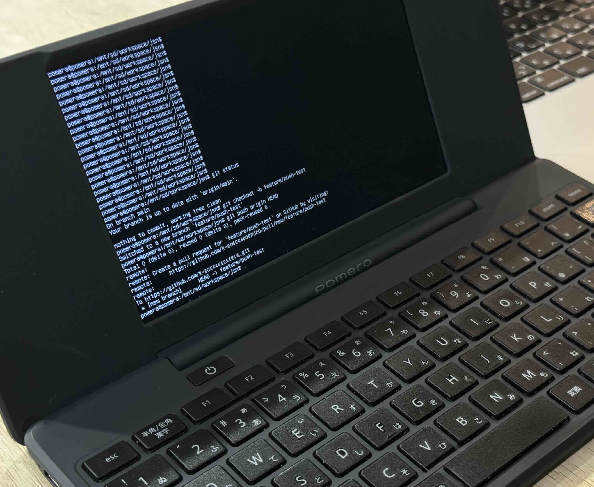

# ポメラDM250にLinuxを入れてGithubにpushできるようにする
小説の執筆にポメラDM250を使っています。  
ポメラはテキスト編集に特化した軽量デバイスで外出先で非常に重宝します。  
なのですが、溜まったテキストを整理し、全体を俯瞰して推敲するには不向きです。

僕の場合、
1. iPhoneのメモでアイディア整理・プロットの作成
2. ポメラで草稿の書き出し
3. MacBook、VS Codeで推敲  

の流れで書くことが多いです。

2→3をSDカードでやっていたのですが、ひと手間かかります。  
SDカードリーダが手元にない、なんてこともしばしば ^^;

推敲にはVS Codeを使っており、テキストはGithubに保管しています。  
Githubに入れておくと差分管理が楽ですし、バックアップもとれます。  
ポメラがGithub連携をサポートしていればよいのですが、さすがにそんな機能はありません。

ところが、ポメラDM250をLinux化する方法がWeb上で公開されています。  
[Debian on Pomera DM200/DM250](https://www.ekesete.net/log/?p=9504)  
Linuxが動けばもちろんその上でGitも動かせます...！  
こちらには備忘録を兼ねてDM250で実施した流れを残しています。

:::info
メーカー保証外ですので故障のリスクがあります。同様のことをする際は自己責任で！
:::

## ポメラのLinux化
以下の流れで実施します。
1. SDカード(16GB以上)の用意
1. バックアップ・リストア（DM200_DM250_emmc_backup_restore_v0.2）
1. メイン部分のインストール（DM200_DM250_kernel_installer_0.2）
    - 文書作成用なので追加のカーネルアップデートはしていません。 
1. SDカードへのイメージの展開  

詳しくは[上記の記事](https://www.ekesete.net/log/?p=9504)を参照ください。

## Gitのインストール・Githubへのアクセス権付与
1. Wi-Fiの接続
    - ```/mnt/sd/settings/wpa_supplicant.conf```のssid, pskを変更
    ```
    ssid="<my-ssid>"
    psk="<my-password>"
    ```    
    vimなどで編集します。
    iPhoneのテザリングのSSID,パスワードを設定しています。

    - ```sudo /opt/bin/wifi_switch on```を実行
    :::note
    DM250の判定処理が修正されているため、以下の部分を変更する必要があります。
    [/etc/init.d/dm200_wireless](https://github.com/ichinomoto/dm200_tools/blob/939c3ee71ba0c1b930afc00d1741b94482c85017/rootfs_script/files/etc/init.d/dm200_wireless#L5)
    ```
    if [ -b /dev/mmcblk0p27 ]; then
    ```
    :::

1. Gitのインストール
    ```shell
    $ sudo apt-get update
    $ sudo apt-get install git
    ```
    :::note
    update時に`InRelease is not valid yet`というエラーが生じました。  
    `date`コマンドで確認したところ日時にズレが有り、以下で正しい日時にすると動作しました。
    ```
    $ date -s "05/25 13:00 2025"
    ```
    :::

1. アクセストークンの取得  
    ポメラの場合、ブラウザを使った認証ができないためトークンを使います。  
    「Settings」->「Developer Settings」->「Personal Access tokens」から取得できます。
    - Fine-Grained トークンを使用し権限は以下を選択
      - Read access to metadata
      - Read and Write access to code
1. アクセストークンによるアクセス
    - 以下のコマンドでリポジトリをクローン
    ```shell
    $ git clone https://oauth2:<access-token>@github.com/<user-name>/<repo-name>.git
    ```
    `<access-token>`は先ほど取得したトークン、  
    `<user-name>`はGitHubのユーザ名、  
    `<repo-name>`はリポジトリ名に置き換えます。
2. ブランチを作成しpush
    - SDカード上のディレクトリにGitがアクセスできるよう設定
    ```shell
    $ git config --global --add safe.directory /mnt/sd/<work-dir>/<repo-name>
    ```  

    - 以降はGitの操作です
    ```shell
    $ cd <repo-name>
    $ git checkout -b <branch-name>
    $ git push origin HEAD
    ```
    無事にpushできました！
    

## よく使う操作メモ
- 起動: 左Alt + 右Shift + 電源ボタン
- 停止: Ctrl + Alt + Del
- Wi-Fiの有効化: ```sudo /opt/bin/wifi_switch on```

ブランチの作成後は、ポメラとして起動しテキストを編集します。  
編集が終わったら再度Linuxを起動して、コミット・プッシュします。  
これでポメラDM250で書いたテキストをGithubにpushできるようになりました。  
執筆が捗りそうです！　Happy Writing!