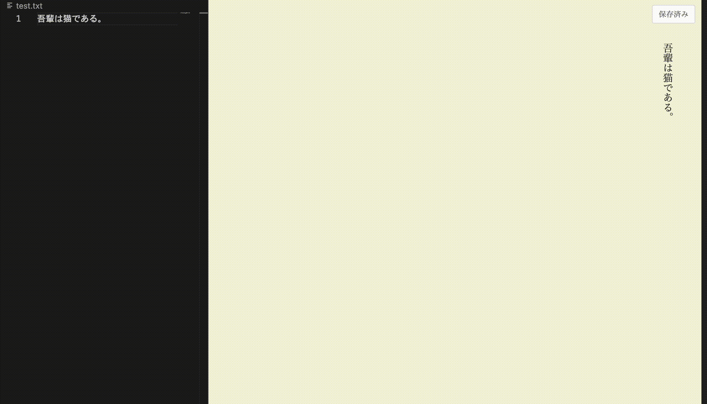

# 縦書き用のVS Code拡張機能を作ってみた
小説を書くとき、個人的に縦書きで書くのが好きです。  
うまく説明しづらいのですが、セリフや段落など文章の構造をぱっと把握しやすい感覚があり、筆が進むように感じるのです。人の目は横に並んでいますから、見開きで見たとき見開き全体が視界に入ります。そのとき無意識に、文字の部分と空白の部分を絵的に捉えているのかもしれません。  
書店で売られている小説っぽさが増すのでモチベーションがあがる、というのもありそうです。  

外出中の隙間時間ではポメラで書いていますが、まとまった時間や家ではノートPCとVS Codeを使っています。VS Codeはプログラミング用のテキストエディタですが、GitHubと連携して差分管理・バックアップができるので使っています。  
縦書き編集がVS Codeでもできるよう、Claude CodeやCopilotの力を借りつつ、縦書き用の拡張機能を作ってみました。  

最低限の機能を実装したのみですが、以下でソースコードとインストール手順を公開しています！  

[k-rainfield/vertedit](https://github.com/k-rainfield/vertedit)

縦書き表示のまま編集できる（いわゆるWYSIWYGエディタとした）ところがこだわりポイントです。  

原稿が長くなっても修正したい箇所をすぐ修正できるよう、こういった形にしました。  
一方で、実装がやや複雑になり、細かな挙動など作り込みの余地が残っています。また、ルビ表示の機能や行数・文字数設定も追加したいと思っています。  
もう少し改良できたら、マーケットプレイスにも公開するつもりです！  